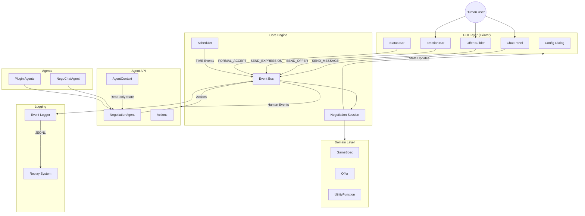
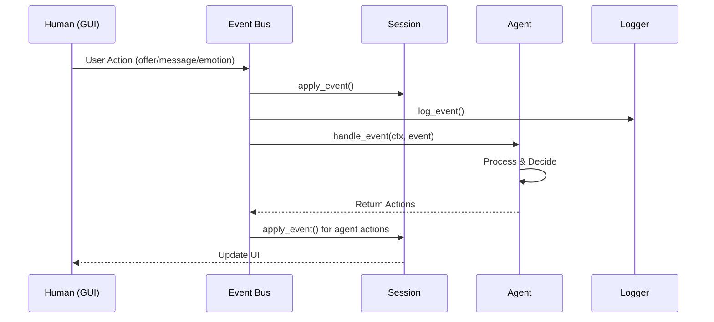

# NegoPlatform Architecture

## System Overview



## Event Flow



## Event Types

```mermaid
graph LR
    subgraph Events
        SEND_MESSAGE[SEND_MESSAGE]
        SEND_OFFER[SEND_OFFER]
        SEND_EXPRESSION[SEND_EXPRESSION]
        OFFER_IN_PROGRESS[OFFER_IN_PROGRESS]
        TIME[TIME]
        FORMAL_ACCEPT[FORMAL_ACCEPT]
        GAME_START[GAME_START]
        GAME_END[GAME_END]
    end

    subgraph Actions
        SendMessage[SendMessage]
        SendOffer[SendOffer]
        SendExpression[SendExpression]
        FormalAccept[FormalAccept]
        Schedule[Schedule]
        ShowTyping[ShowTyping]
    end

    Events --> |Trigger| Agent((Agent))
    Agent --> |Returns| Actions
```



---

## NegotiationAgent API Reference

The `NegotiationAgent` class is the base class that all custom agents must extend. Agents respond to events by returning a list of `Action` objects.

### Core Methods

| Method | Signature | Description |
|--------|-----------|-------------|
| `__init__` | `(agent_id: str = "agent")` | Initialize the agent with an identifier |
| `configure` | `(config: dict) -> None` | Configure agent with parameters from JSON/dict |
| `handle_event` | `(ctx: AgentContext, event: Event) -> list[Action]` | Main dispatch method - routes events to handlers |
| `reset` | `() -> None` | Reset agent state for a new negotiation |

### Event Handlers (Override These)

| Method | Signature | Description |
|--------|-----------|-------------|
| `on_game_start` | `(ctx: AgentContext, event: Event) -> list[Action]` | Called when negotiation begins. Use for greeting or opening offer. |
| `on_send_message` | `(ctx: AgentContext, event: Event) -> list[Action]` | Called when human sends a chat message. Access text via `event.get_text()`. |
| `on_send_offer` | `(ctx: AgentContext, event: Event) -> list[Action]` | Called when human proposes an offer. Main negotiation logic goes here. |
| `on_send_expression` | `(ctx: AgentContext, event: Event) -> list[Action]` | Called when human sends an emotion. Access via `event.get_expression()`. |
| `on_offer_in_progress` | `(ctx: AgentContext, event: Event) -> list[Action]` | Called when human is actively editing an offer. |
| `on_time` | `(ctx: AgentContext, event: Event) -> list[Action]` | Called on periodic time ticks. Use for timeout behaviors. |
| `on_formal_accept` | `(ctx: AgentContext, event: Event) -> list[Action]` | Called when human formally accepts. Agent can accept to finalize deal. |
| `on_game_end` | `(ctx: AgentContext, event: Event) -> list[Action]` | Called when negotiation ends. Use for cleanup or final messages. |

### Utility Methods

| Method | Signature | Description |
|--------|-----------|-------------|
| `get_name` | `() -> str` | Get the agent's display name |
| `get_avatar` | `() -> Optional[str]` | Get the agent's avatar identifier |
| `get_description` | `() -> str` | Get a description of this agent |
| `get_config` | `(key: str, default=None)` | Get a configuration value |

### Available Actions

Agents return lists of these action types:

| Action | Constructor | Description |
|--------|-------------|-------------|
| `SendMessage` | `(text: str, subtype: MessageSubtype, delay_ms: int = 0)` | Send a chat message |
| `SendOffer` | `(offer: Offer, delay_ms: int = 0)` | Propose an offer |
| `SendExpression` | `(expression: Expression, duration_ms: int = 2000, delay_ms: int = 0)` | Display an emotion |
| `FormalAccept` | `(delay_ms: int = 0)` | Formally accept current offer |
| `Schedule` | `(delay_ms: int, callback: Callable)` | Schedule a delayed action |
| `ShowTyping` | `(duration_ms: int = 1000)` | Show typing indicator |

### AgentContext (Read-Only State)

The `AgentContext` provides read-only access to negotiation state:

| Property/Method | Type | Description |
|-----------------|------|-------------|
| `game` | `GameSpec` | The game specification |
| `issues` | `list[Issue]` | List of negotiation issues |
| `current_offer` | `Offer` | Current offer on the table |
| `elapsed_time` | `float` | Seconds since start |
| `remaining_time` | `Optional[float]` | Seconds until deadline (if any) |
| `get_agent_utility()` | `float` | Agent's utility for current offer |
| `get_agent_utility_percent()` | `float` | Agent's utility as percentage (0-1) |
| `get_opponent_utility()` | `float` | Human's utility for current offer |
| `can_formally_accept()` | `bool` | Whether formal accept is valid |
| `get_offer_history()` | `list[dict]` | History of all offers |
| `get_message_history()` | `list[dict]` | History of all messages |

### Minimal Example

```python
from negoplatform.agent_api.base import NegotiationAgent
from negoplatform.agent_api.actions import SendMessage, SendOffer, FormalAccept
from negoplatform.core.events import MessageSubtype

class MyAgent(NegotiationAgent):
    def on_game_start(self, ctx, event):
        return [SendMessage("Hello! Let's negotiate.", subtype=MessageSubtype.GREETING)]
    
    def on_send_offer(self, ctx, event):
        if ctx.get_agent_utility_percent() >= 0.5:
            if ctx.can_formally_accept():
                return [
                    SendMessage("Deal!", subtype=MessageSubtype.OFFER_ACCEPT),
                    FormalAccept()
                ]
        return [SendMessage("I need more.", subtype=MessageSubtype.OFFER_REJECT)]
```
